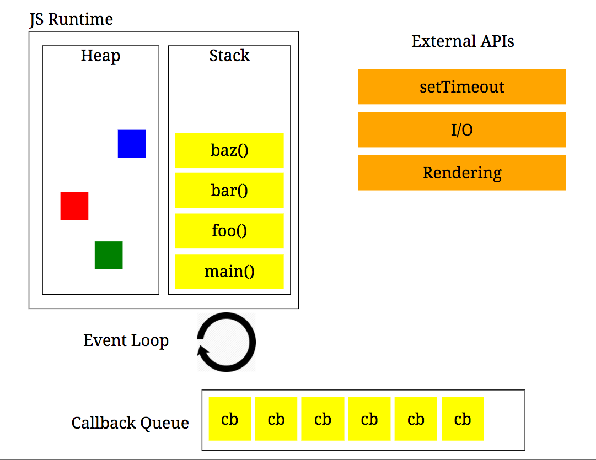

# Event loop

### Components of Javascript
1. JS Runtime - **Single threaded**
   <!--lint disable list-item-bullet-indent-->
  - a. Heap
  - b. Call stack
    <!--lint enable list-item-bullet-indent-->
2. External APIs (WebAPIs for browser or C++ implementations for node)
3. Callback queue
4. Event loop

**NOTE: If we didn't have these other components (2, 3 and 4) then browser would be continuously blocked
by slow calls (that should be async) as the Javascript runtime is single threaded. These other
components help manage concurrency with the use of async callbacks**

#### 1a. JS Runtime - Heap
- Where memory is allocated for Javascript programs

#### 1b. JS Runtime - Call stack
- Data structure that records where you are in the program
  - If we step into a function, we push something on to the stack
  - If we return from a function, we pop something off the stack
- Can see state of call stack when error occur via stacktrace in console
- If we infinitely recurse a function, this can cause a stack overflow error (Maximum call stack size exceeded)

#### 2. External APIs
- APIs that are external to Javascript runtime and handle blocking and slow processing. For example:
  - Network requests
  - setTimeout (minimum time to execute callback)
  - etc.
- Able to run external to the single-threaded Javascript runtime
- Once finished processing, will push callback to callback queue

#### 3. Callback queue
- Queue where external APIs when done will place the callback code

#### 4. Event loop
- Looks at call stack and callback queue
- Process anything on call stack first
- Once call stack is empty, take first item off queue and onto the call stack to process

### Notes
- That's why sometimes we see `setTimeout` with 0 which is to defer processing until the call stack is clear
- Callbacks will queue if triggered consecutively and has not finished running call stack (e.g. setTimeout, on scroll event listener, etc)
- Interacts with rendering which is constrained by code on the call stack but is given higher priority to run then the callback queue. **Don't block rendering with code on call stack**

> References
> * [Philip Roberts: What the heck is the event loop anyway? | JSConf EU 2014 | 09-Oct-2014](https://www.youtube.com/watch?v=8aGhZQkoFbQ)
> * [Diagram of event loop,call stack and callback queue](https://vlucas.github.io/presentation-slides-you-dont-know-nodejs/img/js-env.png)
> * [Visualisation to help understand event loop, call stack and callback queue](http://latentflip.com/loupe/?code=JC5vbignYnV0dG9uJywgJ2NsaWNrJywgZnVuY3Rpb24gb25DbGljaygpIHsKICAgIHNldFRpbWVvdXQoZnVuY3Rpb24gdGltZXIoKSB7CiAgICAgICAgY29uc29sZS5sb2coJ1lvdSBjbGlja2VkIHRoZSBidXR0b24hJyk7ICAgIAogICAgfSwgMjAwMCk7Cn0pOwoKY29uc29sZS5sb2coIkhpISIpOwoKc2V0VGltZW91dChmdW5jdGlvbiB0aW1lb3V0KCkgewogICAgY29uc29sZS5sb2coIkNsaWNrIHRoZSBidXR0b24hIik7Cn0sIDUwMDApOwoKY29uc29sZS5sb2coIldlbGNvbWUgdG8gbG91cGUuIik7!!!PGJ1dHRvbj5DbGljayBtZSE8L2J1dHRvbj4%3D)
> * [Code for Visualisation](https://github.com/latentflip/loupe)
