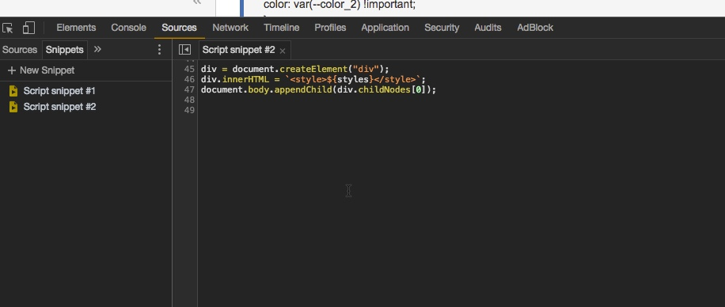

# How to change CSS styles of a site using Chrome developer tools via snippets

Use the following code and create a new snippet under `Sources -> Snippets -> + New Snippet`:

```Javascript
var styles, div;

styles = `
:root {
--color_1: #ffd503;
}

a {
  color: var(--color_1);
}
`;

div = document.createElement("div");
div.innerHTML = `<style>${styles}</style>`;
document.body.appendChild(div.childNodes[0]);
```


